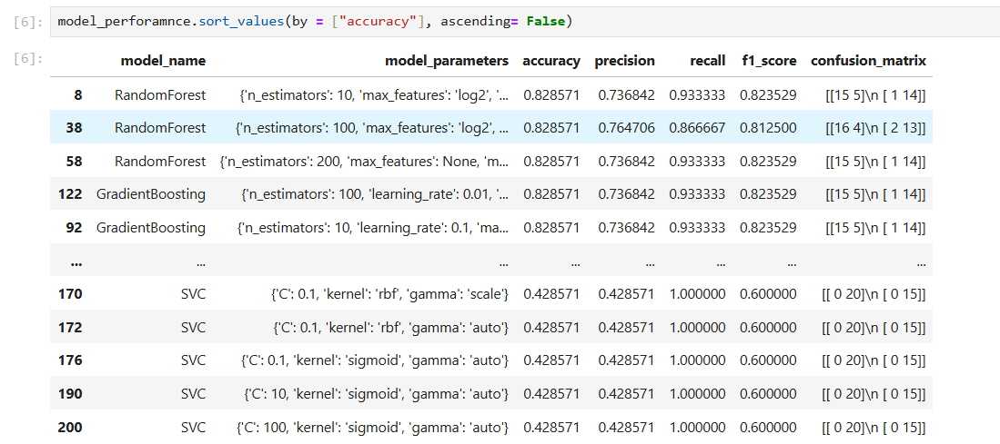

In this lab, we underwent the process of trying to predict whether the person has tumor or not by preparing a dataset and training a model from labelled images.

**Notes**

I computed the sequential time for the program. I lost the values as I had to restart the kernel of ipynb file. 

Here are some time Metrics:

**Sequential Run**

**Task One**

**Task Two**

**Machine Learning Metrics**

**Task Three**

I saved the dataframe in to an excel file. In order to make it convenient to use, I created a separate model_performance.py file. I will add a snippet of it here.

I did a grid search to find the most optimal model. The excel file under data/model_performance contains the excel file of all the all the models.

Best,

